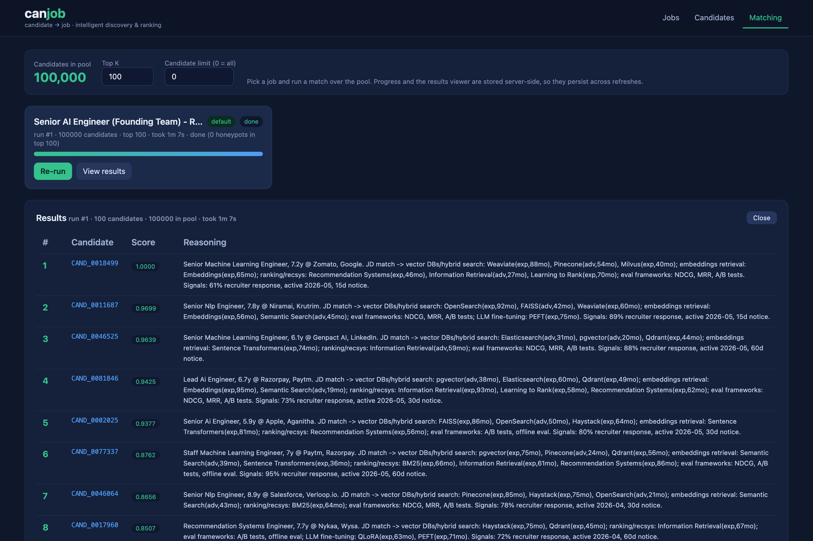
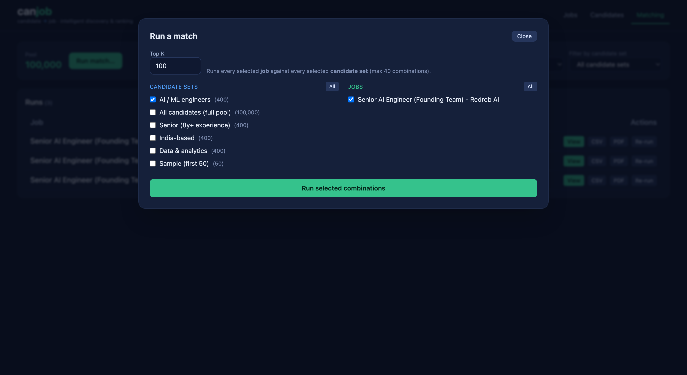
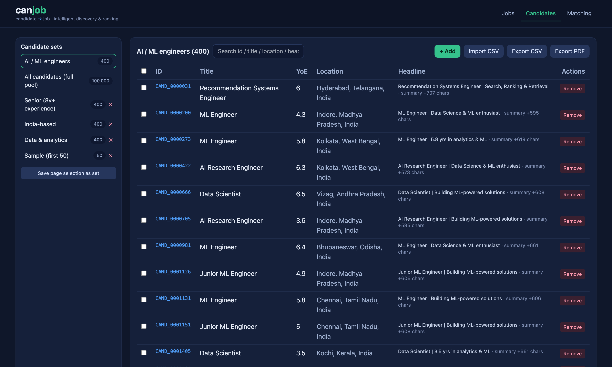

# CanJob: Intelligent Candidate Discovery & Ranking

A local, offline, CPU-only ranking system for the Redrob hackathon. It ranks the top 100 candidates from `candidates.jsonl` against the released job description, with an evidence-based reasoning for every pick. No network and no LLM API at rank time.

**The name.** *CanJob* = **candidate → job**: the whole system exists to map candidates onto a job (intelligent candidate discovery and ranking). It also reads as "can-job", i.e. who can actually do this job, which is exactly what the JD asks us to figure out beyond keyword matching.

**Links**

- Code: https://github.com/NavpreetDevpuri/canjob
- Colab sandbox (run it in the browser): https://colab.research.google.com/github/NavpreetDevpuri/canjob/blob/main/demo_colab.ipynb
- Approach presentation (Google Slides): https://docs.google.com/presentation/d/1Iv0IG5LeATLk4ZPGnrk7dEI11eTv76IOFBPkb0CpE2I/edit (also committed as `docs/canjob_idea_submission.pdf`)

## Reproduce the submission (single command)

```bash
# 1. install core deps (numpy, pandas, scikit-learn, orjson)
pip install -r requirements.txt

# 2. produce the ranked CSV  (CPU-only, offline, ~30s for 100k)
python rank.py --candidates ./candidates.jsonl --out ./submission.csv
```

That is the full scoring step that produces `submission.csv`. It needs no GPU, no network, and finishes in well under the 5-minute budget. The semantic signal is read from a small artifact committed to the repo (see Pre-computation below), so no model or torch is needed here.

## Compute-constraint compliance

| Constraint | Limit | This system |
|---|---|---|
| Runtime (ranking step) | <= 5 min | ~30s local, ~50s in Docker, for the full 100k |
| Memory | <= 16 GB | comfortably under (vectorized, single pass) |
| Compute | CPU only | no GPU anywhere in the ranking step |
| Network | off | ranking reads only local files (verified with `docker run --network none`) |
| Disk | <= 5 GB | committed artifact is ~0.6 MB; optional cache ~150 MB |

## How it works

One vectorized pipeline (pandas, numpy, scikit-learn), no per-row Python loops.

1. **Load and featurize.** Candidates are read with orjson into one tabular row each. Nested arrays (skills, career history, education, the 23 Redrob signals) are flattened with `json_normalize` plus groupby, so every later step is a column operation.
2. **Flag honeypots.** Boolean column checks catch logically impossible profiles (for example "expert" proficiency on a skill used 0 months, a role that ends before it starts, or tenure greater than total experience). Flagged candidates are excluded from the top 100.
3. **Score with three independent lenses**, because each catches what the others miss:
   - **Rules**: a JD-faithful deterministic score from config (required skill facets, experience band, product vs services background, location) minus the penalties the JD spells out (keyword stuffers, CV/speech-only, framework-only, title chasers), then multiplied by a behavioral-availability modifier built from the Redrob signals.
   - **Lexical**: several focused TF-IDF queries (retrieval, ranking/eval, full JD) for keyword recall, instead of one blurry mega-query.
   - **Semantic**: local MiniLM embeddings that match meaning, catching the JD's "Tier-5" candidate who built a recommender at a product company but never writes "RAG" or "Pinecone". These scores are precomputed offline (below).
4. **Merge with Reciprocal Rank Fusion (RRF).** Each lens produces a ranking; the fused score is the sum over lenses of `weight / (k + rank)`. Combining on ranks means no single lens scale can dominate. Weights live in `jd_facets.json` under `ensemble_weights`.
5. **Gate with the grounded rules.** The lexical and semantic lenses both read the candidate's *own* text (summary, headline, skill names), which is exactly what a keyword-stuffer games, so a "Content Writer | exploring GenAI" who pasted in vector-DB skills can win two of the three lenses on buzzwords alone. To prevent that, the deterministic model also acts as an *eligibility gate* on the fused score: a profile whose **current title is off-domain and that has never held an engineering/data/ML role** (judged from `career_history` titles, which are far harder to fake than a skills list) is multiplied down hard. It demotes rather than hard-excludes, so it stays honest and auditable. In practice this moves the off-domain Content Writer from #1 to ~#21,800 / 100,000, while genuine senior ML/NLP engineers fill the top, with honeypots still 0 in the top 100.
6. **Rank and explain.** Honeypots are dropped, ties break by `candidate_id`, scores are non-increasing, and each row gets a reasoning string citing concrete profile evidence.

## Behavioral signals (the 23 Redrob signals)

The JD is explicit that a perfect-on-paper candidate who is unreachable is not actually hireable. The rules score is multiplied by a bounded availability/engagement modifier that combines: recruiter response rate, last-active recency, open-to-work, interview completion rate, offer acceptance rate, recruiter saves (demand), profile completeness, GitHub activity, verification, and notice period. Missing history (for example no prior offers) is treated as neutral, not penalized.

## Honeypots

The dataset hides ~80 honeypots (subtly impossible profiles), forced to relevance tier 0; >10% in the top 100 is disqualifying. We detect a high-precision set of impossible profiles and exclude them. Every run prints `Honeypots in submitted top 100: 0`, which you can verify directly. We deliberately avoid noisy checks (for example salary min>max) that fire on legitimate candidates.

## Benchmark on public, labelled data

**In one line:** on a public dataset of real recruiter decisions that we never saw or
tuned on, CanJob surfaces the genuinely good-fit candidates **about 4–5x more often than
chance** — proof the ranking is real, not luck or overfitting.

Since the challenge data has no published labels, `benchmark/` validates the ranking
method on an independent dataset that *does*:
[`cnamuangtoun/resume-job-description-fit`](https://huggingface.co/datasets/cnamuangtoun/resume-job-description-fit)
(1,759 resume↔JD pairs that humans labelled Good / Potential / No-Fit, across 71 jobs;
477 unique resumes). For each job we rank **the whole pool of 477 candidates** and check
how high the recruiter's "Good Fit" picks land, using the competition metrics:

| method | NDCG@10 | NDCG@50 | MAP | P@10 | vs random (P@10) |
|---|---|---|---|---|---|
| random floor (shuffle) | 0.049 | 0.084 | 0.061 | 0.047 | 1x |
| tfidf keyword match | 0.205 | 0.235 | 0.137 | 0.189 | 4x |
| embeddings (MiniLM) | 0.210 | 0.257 | 0.150 | 0.211 | 5x |
| **ensemble (RRF, semantic-led)** | **0.219** | **0.267** | **0.156** | 0.200 | **4x** |

**How to read the numbers** (all 0–1, higher = better; "random floor" is the score from
shuffling, so the real skill is the *multiple* above it):

- **P@10** — of the 10 people we put at the top, how many are genuine "Good Fit". We get
  ~0.20 (≈ 2 of 10) vs ~0.047 by chance, i.e. **~4x more good fits at the top than random**.
- **NDCG@10 / NDCG@50** — is the top 10 / 50 in the right order, best-fit first (1.0 = perfect).
- **MAP** — overall ranking quality across *all* the good-fit candidates.

**Why the absolute numbers look modest** (this is the honest part): this is the *hardest*
fair test — we rank the entire pool from scratch, count **only** the strict "Good Fit"
label as a win (a "Potential Fit" we surface still counts as a miss), and any resume the
dataset didn't judge for that job is assumed a No-Fit (so a good candidate we rank highly
but that nobody labelled counts *against* us). Several JDs are also vague boilerplate
("Who we are? For 20 years we have powered digital experiences…") with nothing concrete
to match on, and "fit" is a subjective recruiter call. Under those conservative rules,
**4–5x over chance is a strong signal**, and the **RRF ensemble is the best method overall**
(top NDCG@10, NDCG@50 and MAP), which is exactly what the three-lens design is for.

This benchmark only tests the generalisable recall core. The Redrob-specific rules +
eligibility gate (our actual differentiator) needs the Redrob profile schema, so it is
validated on the challenge data itself, where it moves the off-domain "Content Writer"
from rank #1 to #21,804 / 100,000, with 0 honeypots in the top 100.

Reproduce: `pip install -r benchmark/requirements.txt && python benchmark/run_benchmark.py`. See `benchmark/README.md`.

## Pre-computation (allowed; outside the timed window)

The spec allows pre-computation as long as the step that produces the CSV stays in budget. The only heavy part is MiniLM embeddings, so we precompute them once and reduce them to a tiny per-job artifact:

```bash
pip install -r requirements.txt -r requirements-embeddings.txt   # adds torch + transformers
python precompute.py --candidates ./candidates.jsonl
# writes canjob/config/jobs/<job_key>/precomputed/semantic_scores.npz  (~0.6 MB, committed)
```

This artifact (candidate_id -> cosine-to-JD score) is committed to the repo, so `rank.py` and the Docker reproduction get the semantic signal with no torch and no network. The full embedding matrix is cached under `output/` (gitignored) so re-runs are fast. `rank.py` runs fine without it too (`--no-semantic` or a missing artifact falls back to the rules + lexical ensemble).

## Configuration is per-job

Turning a JD into config is a one-time offline step (by hand or with an LLM). Each job has its own folder so the same code serves many jobs:

```
canjob/config/jobs/<job_key>/
    job.txt          the raw job description (the only human input)
    jd_facets.json   JD -> weighted facets, penalties, queries, fusion weights
    filters.json     honeypot thresholds + skill/title/location vocab
    meta.json        company, title, hash
    precomputed/semantic_scores.npz   committed semantic artifact
```

`job_key = slug(company)__slug(title)__hash8(job.txt)`, so every JD revision is a distinct folder. Select with `--job <key>` (auto when there is one).

`jd_facets.json` holds `experience`, `positive_facets`, `negative_facets`, `services_companies`, `offdomain_titles`, `strong_titles`, `preferred_locations`, `penalty_params`, `weights`, `facet_queries`, and `ensemble_weights`. `filters.json` holds `honeypot_thresholds` and the skill/title/location vocab.

## Docker (Stage-3 parity, offline)

```bash
docker build -t canjob .
docker run --rm --network none \
  -v "$PWD/candidates_dir:/data:ro" \
  -v "$PWD/output:/out" \
  canjob --candidates /data/candidates.jsonl --out /out/submission.csv
```

The image installs only core deps (no torch) and copies the committed semantic artifact, so the ranking runs fully offline and finishes in ~50s for 100k. Verified with `--network none`.

## Sandbox demo

`demo_colab.ipynb` is a run-all Google Colab notebook (Section 10.5 sandbox): a config panel at the top, a small bundled sample (or your own upload, or the full dataset via Drive), and an end-to-end run that prints the ranked table, a validity check, and a score chart.

## Web UI (bonus)

A small FastAPI backend and a single-page UI (`app/`) wrap the exact same ranking engine so you can drive it from a browser.

The **Matching** tab: a filterable list of runs and the ranked output (note the top picks are genuine senior ML/NLP engineers with deep, long-tenure skills, with evidence reasoning per row):



The **Run-match popup**: tick the job(s) and candidate set(s); it queues every selected combination.



The **Candidates** tab: curated candidate sets on the left, headline previews with a hidden-character count, import/export, and clickable rows that open the full profile.



```bash
pip install -r requirements.txt -r requirements-app.txt
# optional: point at the full dataset (otherwise it seeds the bundled sample)
export CANJOB_CANDIDATES=$PWD/../India_runs_data_and_ai_challenge/candidates.jsonl
python app/server.py          # open http://127.0.0.1:8000
```

Three tabs, one page:

- **Jobs** - the released JD is pre-loaded as the default job and rendered as markdown. Group jobs into **job sets**; add or remove ad-hoc jobs by pasting a JD (ad-hoc jobs are ranked from their JD text; the default job uses the tuned config + precomputed semantic scores). **Import** jobs from a CSV (`name,jd_markdown`) and **export** to CSV/PDF.
- **Candidates** - the 100k pool is pre-loaded; a few **candidate sets** are seeded (AI/ML engineers, Senior 8y+, India-based, Data & analytics, Sample, plus the full pool) so the UI stays light. Each row shows a headline preview with a hidden-character count; click a row for the full profile. Search, paginate, add/remove, tick rows and save the selection as a new set. **Import** candidates from a CSV (`candidate_id,title,yoe,location,headline`, the same shape as the export); a malformed header raises a clear error.
- **Matching** - a **Run-match popup** where you tick the **job(s)** and the **candidate set(s)** you want; it queues every selected job x set combination (matching is set-level, not per-candidate, to stay simple). Runs are serialized through a background worker with a live, refresh-proof progress bar and listed in a **filterable runs table** (filter by job or by candidate set). Each finished run shows timing and opens the ranked top-K, **paginated 100 per page** (0-1 fit score + evidence reasoning).
- **Export / import** - download any ranked run as **CSV** or a **print-ready PDF** (also candidates and jobs); import jobs and candidates from CSV with format validation. The ranked output can be submitted as a document straight from the UI.

State lives in a local SQLite file (`app/canjob_app.db`, gitignored). The UI runs the identical featurize -> 3-lens score -> RRF -> honeypot-filter pipeline as `rank.py`.

## Layout

```
rank.py                 single-command entrypoint (-> canjob.ranker)
precompute.py           offline embedding precompute -> small committed artifact
canjob/
  ranker.py             orchestration: load -> featurize -> score -> RRF -> CSV
  featurize.py          vectorized features, JD-aware score, honeypots, TF-IDF, RRF
  embeddings.py         offline MiniLM (used only by precompute.py)
  candidate_adapter.py  candidate -> SearchableDocument (search-engine path)
  config/jobs/<key>/    per-job config + committed semantic artifact
search_engine/          local lexical search engine (reusable reference module)
app/                    bonus web UI: FastAPI backend + single-page frontend
benchmark/              robustness check on a public labelled dataset (NDCG/MAP/P@10)
requirements.txt / requirements-embeddings.txt / requirements-app.txt / environment.yml
Dockerfile / run.sh / run.bat / demo_colab.ipynb
docs/canjob_idea_submission.pdf   approach presentation (what we built, why, and how)
submission_metadata.yaml
```

## Output

`submission.csv`: exactly 100 rows, UTF-8, columns `candidate_id,rank,score,reasoning`, scores non-increasing, ranks 1..100 unique, validated by `validate_submission.py`. The reasoning cites concrete evidence (named skills with proficiency and months, product vs services employers, evaluation terms found in the candidate's own writing) mapped to JD requirements, with honest concerns where they exist.

## Credits & AI usage

The ideas and design here are mine (the developer): the three-lens ensemble (rules + lexical + semantic) fused with RRF, modelling the JD as per-job config, the high-precision honeypot logic, the offline precompute / in-budget rank split, reusing a local search engine, and the whole web-UI design (sets, the run-match flow, exports). I used **Cursor** (an AI coding assistant) to turn those ideas into code quickly, refactor, and write the boilerplate. No candidate data is sent to any hosted LLM and the ranking step makes zero LLM/API calls; the only model used anywhere is the local MiniLM in the offline pre-computation. In short: the architecture and decisions are human; the typing was accelerated with AI.
